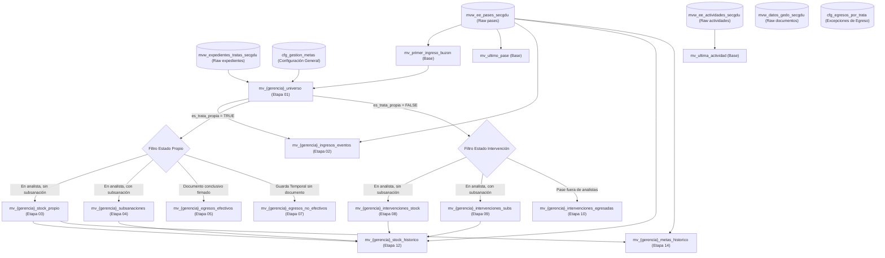

# Estructura del Modelo de Datos y Vistas - SGDU Analytics

Este documento describe de manera exhaustiva y detallada la arquitectura de base de datos, la estructura de tablas de configuración y la secuencia modular de compilación de **Vistas Materializadas** implementadas en el script principal `mv/vistas_master.sql` para el sistema **SGDU Analytics**.

---

## 1. Arquitectura General y Flujo de Datos

El sistema de datos de SGDU Analytics opera mediante un pipeline de **ETL (Extract, Transform, Load)** modularizado basado en PostgreSQL. El flujo de datos sigue un recorrido claro desde las tablas transaccionales en bruto de **SADE**, a través de vistas de procesamiento base, hasta las capas de reportes históricos e indicadores de envejecimiento de stock.



---

## 2. Cimientos Transaccionales (Vistas Base)

Antes de procesar la lógica específica de cada sector, `vistas_master.sql` compila **tres vistas base transaccionales** fundamentales. Estas vistas actúan como el cimiento que unifica y optimiza las consultas subsecuentes sobre el historial de SADE.

### A. `mv_primer_ingreso_buzon`
*   **Propósito:** Determinar la fecha más temprana y el buzón (`destinatario`) en el que cada expediente ingresó por primera vez a un sector.
*   **Lógica:** Agrupa la tabla `mvw_ee_pases_secgdu` por `id_expediente` y `destinatario`, obteniendo el `MIN(fecha)`.
*   **Índices:**
    *   Único en `(id_expediente, destinatario)`.

### B. `mv_ultimo_pase`
*   **Propósito:** Identificar la ubicación actual exacta de cada expediente, quién lo envió y bajo qué estado de pase.
*   **Lógica:** Utiliza una función de ventana `ROW_NUMBER() OVER (PARTITION BY id_expediente ORDER BY fecha DESC)` sobre la tabla `mvw_ee_pases_secgdu` para extraer la fila con valor `1` (el movimiento más reciente).
*   **Atributos clave:** `destinatario_actual`, `fecha_ultimo_pase`, `usuario_remitente`, `estado_en_pase`.
*   **Índices:**
    *   Único en `id_expediente`.

### C. `mv_ultima_actividad`
*   **Propósito:** Conocer el estado de la última actividad del expediente (particularmente útil para solicitudes de subsanación TAD).
*   **Lógica:** Utiliza `ROW_NUMBER() OVER (PARTITION BY id_expediente ORDER BY fecha_alta DESC)` sobre `mvw_ee_actividades_secgdu` para aislar la actividad más reciente.
*   **Atributos clave:** `usuario_alta`, `nombre_tipo_actividad`, `estado_actividad`, `fecha_alta`, `fecha_cierre`, `usuario_cierre`.
*   **Índices:**
    *   Único en `id_expediente`.

---

## 3. Capa de Parametrización y Configuración (Etapa 00)

Para desacoplar las reglas de negocio de la lógica SQL dura, el proyecto utiliza dos tablas de parametrización. Esto permite alterar el comportamiento del ETL (agregar analistas, cambiar códigos de trámite o modificar documentos de egreso) sin tocar las vistas de cálculo.

### A. Tabla `cfg_gestion_metas`
Es la tabla central que describe a cada gerencia. Contiene los siguientes parámetros críticos:
*   `gerencia` (VARCHAR): Identificador clave de la gerencia (ej. `'catastro'`, `'regularizacion'`).
*   `trata_reporte` (VARCHAR): Nombre amigable del trámite o del reporte consolidado.
*   `tratas_incluidas` (VARCHAR[]): Array con los códigos SADE de trámites considerados "propios" del sector.
*   `buzones_ingreso` (VARCHAR[]): Whitelist de buzones donde los expedientes de trámites propios hacen su ingreso formal al sector.
*   `analistas_oficiales` (VARCHAR[]): Whitelist de usuarios y buzones internos que procesan expedientes de forma oficial en el área. Determina qué expedientes están en stock de analistas.
*   `acronimos_egreso` (VARCHAR[]): Tipos de documentos oficiales de GEDO que marcan la finalización exitosa del expediente.
*   `firmantes_egreso` (VARCHAR[]): Whitelist opcional de usuarios firmantes autorizados para que el egreso sea válido. Si es `NULL`, se acepta cualquier firmante.
*   `buzones_ingreso_intervenciones` (VARCHAR[]): Whitelist de buzones por donde entran expedientes ajenos (intervenciones).

### B. Tabla `cfg_egresos_por_trata`
Permite definir excepciones o reglas de egreso extremadamente detalladas a nivel de código de trámite individual (`trata`), detallando qué acrónimos de documento son válidos y opcionalmente qué firmantes y en qué rango de fechas.

---

## 4. Estructura y Etapas Secuenciales de Compilación

Para cada una de las **9 gerencias** (`catastro`, `instalaciones`, `regularizacion`, `contable`, `etapa_proyecto`, `aviso_obra`, `morfologia`, `aph`, `usos`), el ETL ejecuta de forma estrictamente secuencial las siguientes **Etapas de Compilación**:

> [!NOTE]
> La modularidad por etapas garantiza que si hay un cambio metodológico en cómo se mide el stock, solo se alteran las etapas correspondientes, preservando la integridad del universo e ingresos base.

---

### Etapa 01: Universo (`mv_{gerencia}_universo`)
*   **Propósito:** Definir el universo total de expedientes que han interactuado con la gerencia.
*   **Lógica:**
    *   Filtra expedientes que registren pases a través de `mv_primer_ingreso_buzon` dirigidos a los buzones del sector.
    *   Clasifica los expedientes en dos categorías clave:
        *   **Trámite Propio (`es_trata_propia = TRUE`):** La `trata` del expediente está en `tratas_incluidas` y el ingreso ocurrió por `buzones_ingreso`.
        *   **Intervención (`es_trata_propia = FALSE`):** La `trata` no es propia, pero ingresó por los `buzones_ingreso_intervenciones` configurados.
    *   Determina `fecha_primer_ingreso_gerencia` como el primer pase que gruza la frontera de buzones del sector.
*   **Reglas Especiales:**
    *   *Regularización:* Excluye explícitamente expedientes históricos anteriores al 2026 bajo ciertos códigos de trata (ej. `MDUG3001A`) para mantener la consistencia del modelo analítico actual.
*   **Índices:** Único en `id_expediente`.

---

### Etapa 02: Ingresos Eventos (`mv_{gerencia}_ingresos_eventos`)
*   **Propósito:** Registrar cronológicamente el primer evento exacto de llegada al sector para cada expediente del universo.
*   **Lógica:** Extrae el registro de pase más antiguo (`fecha`) en `mvw_ee_pases_secgdu` dirigido a los buzones del sector para cada expediente.
*   **Índices:** No posee índice único (funciona como log de eventos de entrada).

---

### Etapa 03: Stock Propio (`mv_{gerencia}_stock_propio`)
*   **Propósito:** Identificar trámites propios que se encuentran actualmente bajo análisis activo en el sector.
*   **Lógica:**
    *   El expediente debe pertenecer al universo propio (`es_trata_propia = TRUE`).
    *   La ubicación actual (`mv_ultimo_pase.destinatario_actual`) debe estar dentro de la lista de `analistas_oficiales`.
    *   **Filtro Crítico:** El expediente **no** debe tener una solicitud de subsanación TAD pendiente (`SOLICITUD_SUBSANACION_TAD` en estado `'PENDIENTE'` iniciada por el analista actual en `mv_ultima_actividad`).
    *   Calcula:
        *   `dias_en_poder_actual`: Días transcurridos desde el último pase al analista actual.
        *   `dias_en_gerencia`: Días totales desde el primer ingreso a la gerencia (`fecha_primer_ingreso_gerencia`).
*   **Índices:** Único en `id_expediente`.

---

### Etapa 04: Subsanaciones (`mv_{gerencia}_subsanaciones`)
*   **Propósito:** Listar expedientes propios que están "en pausa" porque se ha solicitado una corrección al ciudadano/profesional externo.
*   **Lógica:**
    *   El expediente pertenece a `es_trata_propia = TRUE`.
    *   Está actualmente asignado a un analista del sector (`analistas_oficiales`).
    *   **Filtro Crítico:** Tiene una actividad de tipo `'SOLICITUD_SUBSANACION_TAD'` en estado `'PENDIENTE'` en `mv_ultima_actividad`.
*   **Índices:** Único en `id_expediente`.

---

### Etapa 05: Egresos Efectivos (`mv_{gerencia}_egresos_efectivos`)
*   **Propósito:** Detectar la resolución formal y exitosa de un expediente propio.
*   **Lógica:**
    *   Identifica el **primer documento digital firmado (GEDO)** (`mvw_datos_gedo_secgdu`) que coincida con los acrónimos autorizados (`acronimos_egreso`) y los firmantes autorizados (`firmantes_egreso`) parametrizados en `cfg_gestion_metas`.
    *   Utiliza `ROW_NUMBER() OVER (PARTITION BY id_expediente ORDER BY fecha_creacion ASC) = 1` para garantizar la inmutabilidad de la fecha de egreso (se toma solo el primer documento conclusivo generado).
*   **Índices:** Único en `id_expediente`.

---

### Etapa 06: GEDOs Egreso (`mv_{gerencia}_gedos_egreso`)
*   **Propósito:** Funcionar como bitácora analítica detallada de todos los documentos conclusivos generados.
*   **Lógica:** Listado plano de documentos válidos de egreso sin la restricción del más antiguo. Es muy útil para auditorías y conteos de flujos mensuales.
*   **Índices:** No posee índice único.

---

### Etapa 07: Egresos No Efectivos (`mv_{gerencia}_egresos_no_efectivos`)
*   **Propósito:** Identificar expedientes propios que salieron del flujo activo del sector sin emitir un documento de egreso formal (ej. pases a archivo definitivo, guarda temporal o derivaciones a otras dependencias).
*   **Lógica:**
    *   El expediente pertenece al universo propio (`es_trata_propia = TRUE`).
    *   El estado actual del expediente en `mv_ultimo_pase` es `'Guarda Temporal'`.
    *   **Filtro Crítico:** No debe existir ningún registro de egreso efectivo en `mv_{gerencia}_egresos_efectivos`.
*   **Índices:** Único en `id_expediente`.

---

### Etapa 08: Intervenciones Stock (`mv_{gerencia}_intervenciones_stock`)
*   **Propósito:** Identificar expedientes de intervenciones externas (`es_trata_propia = FALSE`) en manos de los analistas del área.
*   **Lógica:** Idéntica a la Etapa 03 (Stock Propio), pero filtrando por `es_trata_propia = FALSE`.
*   **Índices:** Único en `id_expediente`.

---

### Etapa 09: Intervenciones Subsanaciones (`mv_{gerencia}_intervenciones_subs`)
*   **Propósito:** Identificar expedientes de intervenciones externas en pausa por solicitud de subsanación TAD al profesional.
*   **Lógica:** Idéntica a la Etapa 04 (Subsanaciones), pero filtrando por `es_trata_propia = FALSE`.
*   **Índices:** Único en `id_expediente`.

---

### Etapa 10: Intervenciones Egresadas (`mv_{gerencia}_intervenciones_egresadas`)
*   **Propósito:** Listar aquellas intervenciones que ingresaron en algún momento pero ya han sido despachadas fuera de la whitelist de analistas del área.
*   **Lógica:**
    *   El expediente es una intervención (`es_trata_propia = FALSE`).
    *   Su destinatario actual en `mv_ultimo_pase` **no** pertenece a la whitelist de `analistas_oficiales`.
*   **Índices:** Único en `id_expediente`.

---

### Etapa 11: Intervenciones Egresos Eventos (`mv_{gerencia}_interv_egresos_eventos`)
*   **Propósito:** Registrar cronológica e inmutablemente la salida física (el pase de egreso) de la intervención.
*   **Lógica:** 
    *   Determina el último pase a un destinatario ajeno a los analistas oficiales utilizando `ROW_NUMBER() OVER (PARTITION BY id_expediente ORDER BY p.fecha DESC) = 1`.
    *   **Excepción Crucial (APH y USOS):** En las gerencias de **APH** y **Usos**, las intervenciones no egresan por pase físico tradicional, sino que egresan formalmente mediante la generación de un documento digital conclusivo (lógica de GEDO similar a la Etapa 05). El sistema implementa esta excepción adaptando el `INNER JOIN` a `mvw_datos_gedo_secgdu`.
*   **Índices:** Único en `id_expediente`.

---

### Etapa 12: Stock Histórico (`mv_{gerencia}_stock_historico`)
*   **Propósito:** Proveer la base temporal mensual para reportar la evolución del stock (rolling 12 meses) de manera retroactiva.
*   **Lógica:**
    *   Utiliza `generate_series` para calcular de manera dinámica las fechas de corte (último día de cada mes) para los últimos 12 meses.
    *   Determina la ubicación del expediente al cierre de cada mes mediante:
        ```sql
        DISTINCT ON (u.id_expediente, fc.fecha_corte)
        ORDER BY u.id_expediente, fc.fecha_corte, p.fecha DESC
        ```
    *   Evalúa de forma retrospectiva si a esa fecha de corte el expediente tenía una subsanación abierta mediante la regla:
        ```sql
        a.fecha_alta::date <= fc.fecha_corte AND (a.fecha_cierre IS NULL OR a.fecha_cierre::date > fc.fecha_corte)
        ```
    *   Agrupa los conteos por mes de cierre, código de trata, pertenencia (`es_trata_propia`) y categoría (`STOCK_PROPIO` o `SUBSANACION`).
*   **Índices:** Índices en `mes_cierre`, `trata`, `categoria` y `es_trata_propia`.

---

### Etapa 14: Metas Histórico (`mv_{gerencia}_metas_historico`)
*   **Propósito:** Clasificar y contabilizar retrospectivamente el stock de trámites propios en base a su antigüedad (envejecimiento) al cierre de cada mes.
*   **Lógica:**
    *   Filtra el stock histórico eliminando expedientes que estaban en subsanación a la fecha de corte (ya que ese tiempo no es imputable a la gerencia).
    *   Clasifica los expedientes del stock neto en dos categorías basadas en los 90 días de antigüedad estándar:
        *   **`stock_sector` (Stock Envejecido):** Expedientes con más de 90 días en la gerencia al momento del corte.
            `SUM(CASE WHEN (fecha_corte - fecha_primer_ingreso_gerencia::date) > 90 THEN 1 ELSE 0 END)`
        *   **`stock_corriente` (Stock Activo Sano):** Expedientes con 90 días o menos en la gerencia.
            `SUM(CASE WHEN (fecha_corte - fecha_primer_ingreso_gerencia::date) <= 90 THEN 1 ELSE 0 END)`
*   **Nota metodológica:** **No existe la Etapa 13** en el script maestro. La transición de la Etapa 12 a la 14 es directa y consistente en todos los sectores.
*   **Índices:** Índices en `fecha_corte` y `trata`.

---

## 5. Cuadro Resumen de Etapas de Compilación

La siguiente tabla resume la estructura uniforme aplicada a cada gerencia, permitiendo identificar rápidamente la composición de cada vista materializada y sus características principales:

| Etapa | Nombre de la Vista Materializada | Dependencia Principal | Tipo de Índice | Filtro Crítico de Negocio |
| :---: | :--- | :--- | :---: | :--- |
| **01** | `mv_{gerencia}_universo` | `mv_primer_ingreso_buzon` | Único (`id_expediente`) | Primer arribo a buzones del sector. |
| **02** | `mv_{gerencia}_ingresos_eventos` | `mvw_ee_pases_secgdu` | Ninguno (Log) | Evento del pase de ingreso original. |
| **03** | `mv_{gerencia}_stock_propio` | `mv_ultimo_pase`, `mv_ultima_actividad` | Único (`id_expediente`) | Trámite propio en manos de analista oficial SIN subsanación. |
| **04** | `mv_{gerencia}_subsanaciones` | `mv_ultimo_pase`, `mv_ultima_actividad` | Único (`id_expediente`) | Trámite propio en manos de analista oficial CON subsanación pendiente. |
| **05** | `mv_{gerencia}_egresos_efectivos` | `mvw_datos_gedo_secgdu` | Único (`id_expediente`) | Primer documento conclusivo válido (GEDO + firmante). |
| **06** | `mv_{gerencia}_gedos_egreso` | `mvw_datos_gedo_secgdu` | Ninguno (Log) | Listado completo de documentos generados. |
| **07** | `mv_{gerencia}_egresos_no_efectivos`| `mv_ultimo_pase`, `mv_egresos_efectivos`| Único (`id_expediente`) | Expediente en Guarda Temporal sin egreso conclusivo. |
| **08** | `mv_{gerencia}_intervenciones_stock` | `mv_ultimo_pase`, `mv_ultima_actividad` | Único (`id_expediente`) | Intervención en analista oficial SIN subsanación. |
| **09** | `mv_{gerencia}_intervenciones_subs` | `mv_ultimo_pase`, `mv_ultima_actividad` | Único (`id_expediente`) | Intervención en analista oficial CON subsanación pendiente. |
| **10** | `mv_{gerencia}_intervenciones_egresadas`|`mv_ultimo_pase` | Único (`id_expediente`) | Intervención con pase actual fuera de analistas del área. |
| **11** | `mv_{gerencia}_interv_egresos_eventos`| `mvw_ee_pases_secgdu` | Único (`id_expediente`) | Pase de salida a destino externo (Excepto APH/Usos: por GEDO). |
| **12** | `mv_{gerencia}_stock_historico` | `mvw_ee_pases_secgdu`, `actividades` | Múltiple | Foto retroactiva mensual del stock (12 meses). |
| **14** | `mv_{gerencia}_metas_historico` | `destinatario_por_corte` | Múltiple | División retroactiva mensual de stock (>90 días vs <=90 días). |

---

## 6. Particularidades y Excepciones por Gerencia

Aunque el framework de 14 etapas es altamente uniforme, existen especificidades requeridas por la naturaleza operativa de ciertos sectores:

*   **Regularización (`regularizacion`):** Posee filtros de exclusión históricos a nivel de Universo (Etapa 01) para omitir expedientes de tratas anteriores a 2026.
*   **Contable (`contable`):** Implementa joins detallados con `cfg_egresos_por_trata` para aplicar tipos de documentos de egreso específicos por cada código de trámite individual en lugar de un listado genérico por sector.
*   **Morfología (`morfologia`):** Implementa una optimización robusta en la Etapa 12 (Stock Histórico) y Etapa 14 (Metas Histórico) para agrupar y procesar conjuntos de datos masivos.
*   **APH y Usos (`aph`, `usos`):** Poseen una regla especial en la Etapa 11 (Egresos de Intervenciones). Al no realizar pases físicos hacia afuera, la salida de la intervención se mide por la generación de un documento digital final (`acronimos_egreso` y `firmantes_egreso`) en lugar del último pase.
